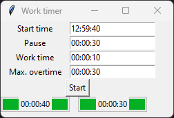

# work_timer
work_timer shows you how long you already work since pressing the start button and how long you still have to work based on your input.

Start time is just an information, it is not used by the application at the moment. It shows the time you started the application, NOT when you really started working. 
Pause defines how long your break is and will be added to the work time. So the left progressbar will show you work time + pause. 
Work time defines the time you have to work. Keep in mind that there is a separate input for pauses. 
Max. overtime defines the time you are willing or allowed (there might be company rules or laws) to spend additionally. This time will be displayed in the right progressbar.
## Configurations
work_timer supports multiple configurations. An example is given in the code at the very beginning and used by default. 
Additional configurations can be added directly in the code or by creating a file called "userConfiguration.py" which will be preferred by the application. 
### The following parameters can be configured
Parameter|Type|Example|Description
|--|--|--|--|
pauseTime|string|00:30:00|Break time in format "HH:MM:SS"
workTime|string|00:06:00|Work time in format "HH:MM:SS"
maxOverTime|string|00:30:00|Maximum overtime in format "HH:MM:SS"
workTimeEndSound|string|C:\\Windows\\Media\\Alarm02.wav|Sound to play when work time reaches 100%. No sounds included, find some on your computer.
overTimeEndSound|string|C:\\Windows\\Media\\Alarm02.wav|Sound to play when work time reaches 100%. No sounds included, find some on your computer.
workTimeThreshold1|float|0.75|Work time label on left progressbar changes its color to yellow when crossing this work time percentage.
workTimeThreshold2|float|0.9|Work time label on left progressbar changes its color to red when crossing this work time percentage.
overTimeThreshold1|float|0.75|Overtime label on right progressbar changes its color to yellow when crossing this work time percentage.
overTimeThreshold2|float|0.9|Overime label on right progressbar changes its color to red when crossing this work time percentage.

To select a specific configuration, use the command line argument.
## Command line arguments
Argument|Description
|--|--|
-configuration|Configuration to use. Defaults to "default".
## Screenshots

  
## License
Please see [LICENSE](LICENSE).